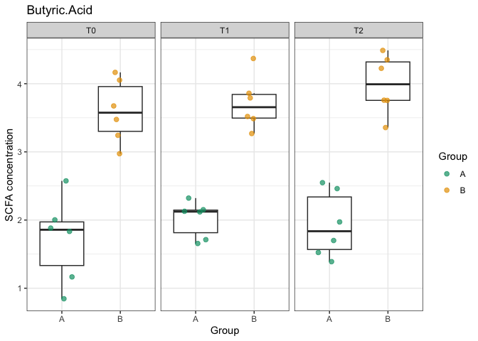

<!-- README.md is generated from README.Rmd. Please edit that file -->

# scfaReporter

<!-- badges: start -->

<!-- badges: end -->

The goal of scfaReporter is to …

## Installation

Install the latest internal build directly from GitHub:

``` r
# install.packages("pak")
pak::pak("MicrobiomeInsights/scfaReporter")
# or: remotes::install_github("MicrobiomeInsights/scfaReporter")
```

## Quick start: run the pipeline on demo data

Two tiny demo datasets ship with the package so you can exercise the
pipeline without external files.

``` r
library(scfaReporter)

# Demo dataset 1: simple two-group comparison
demo1 <- run_scfa_pipeline(
  scfa_data = demo_scfa_dataset1,
  manifest = demo_manifest_dataset1,
  analytes = c("Acetic.Acid", "Propionic.Acid", "Butyric.Acid"),
  stats = "anova",
  aov_formula = value ~ Group
)

# Demo dataset 2: longitudinal design
demo2 <- run_scfa_pipeline(
  scfa_data = demo_scfa_dataset2,
  manifest = demo_manifest_dataset2,
  analytes = c("Acetic.Acid", "Propionic.Acid", "Butyric.Acid"),
  stats = "anova",
  aov_formula = value ~ Group * Time
)

head(demo1$summary)
#> # A tibble: 6 × 10
#>   Analyte        Group Time  Samples Subjects  Mean    SD   SEM   Min   Max
#>   <fct>          <fct> <fct>   <int>    <int> <dbl> <dbl> <dbl> <dbl> <dbl>
#> 1 Acetic.Acid    A     T0         10       10  5.09 0.363 0.115  4.69  5.89
#> 2 Acetic.Acid    B     T0         10       10  8.01 0.382 0.121  7.37  8.44
#> 3 Propionic.Acid A     T0         10       10  2.81 0.452 0.143  2.16  3.61
#> 4 Propionic.Acid B     T0         10       10  3.15 0.457 0.144  2.65  4.08
#> 5 Butyric.Acid   A     T0         10       10  2.04 0.625 0.198  1.02  2.86
#> 6 Butyric.Acid   B     T0         10       10  2.11 0.442 0.140  1.23  2.68
demo2$plots$Butyric.Acid
```



## Generate the SCFA report

Render the bundled Quarto template directly from R:

``` r
library(scfaReporter)

# Demo data (no Chromeleon files required)
render_scfa_report(
  output_file = "demo1.html",
  project_id = "Demo dataset 1",
  scfa_data = demo_scfa_dataset1,
  manifest = demo_manifest_dataset1,
  analytes = c("Acetic.Acid", "Propionic.Acid", "Butyric.Acid"),
  stats = "anova",
  aov_formula = value ~ Group
)

# Real Chromeleon exports + manifest
render_scfa_report(
  output_file = "client_project.html",
  project_id = "P-0123",
  scfa_dir = "data/chromatograms",
  manifest_path = "data/manifest.xlsx",
  normalization_multiplier = 7,
  normalization_basis = "mmol_per_L_plasma",
  stats = "lmer",
  lmer_formula = value ~ Group * Time + (1 | Subject_ID)
)
```

Prefer to edit the template locally? Draft it once and render manually:

1.  Draft:

    ``` r
    rmarkdown::draft(
      file = "reports/my_project.qmd",
      template = "scfa-report",
      package = "scfaReporter",
      create_dir = TRUE
    )
    ```

2.  Update the YAML `params` in `reports/my_project/my_project.qmd` (set
    either `scfa_dir`/`manifest_path` or
    `scfa_data`/`manifest_override`).

3.  Render:
    `quarto::quarto_render("reports/my_project/my_project.qmd")`. The
    HTML report (and optional `scfa_concentration_normalized.csv`)
    appears beside the `.qmd`.
